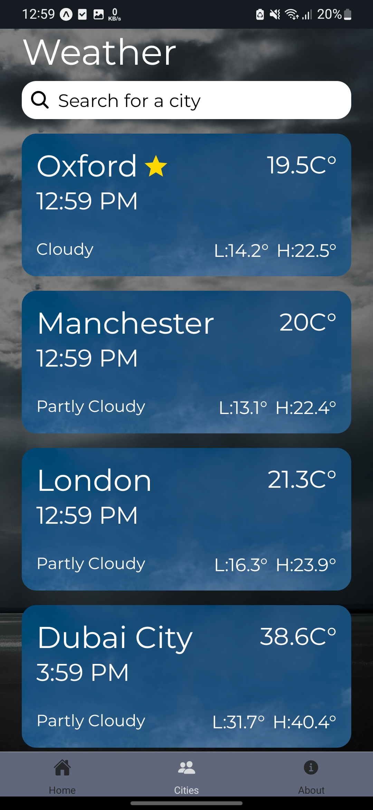

# React-Native-Weather-App
### An app built with React Native Expo and open-meteo APIs to track weather
-------------  

#### Expo SDK Version Used : 49.0.5
#### Design Credit : By  [Claire](https://www.figma.com/@uidesignguide)  
#### Design Files on Figma : [Apple Weather App Clone](https://www.figma.com/community/file/1045320388292781743)  
  
-------------  

## Screenshots 

  
  
  
  
   
  
  
   
  
  

-------------  

## Screens  
- Splash Screen  
- Home Screen
- Cities Screen
- Search City Screen
- About Screen
